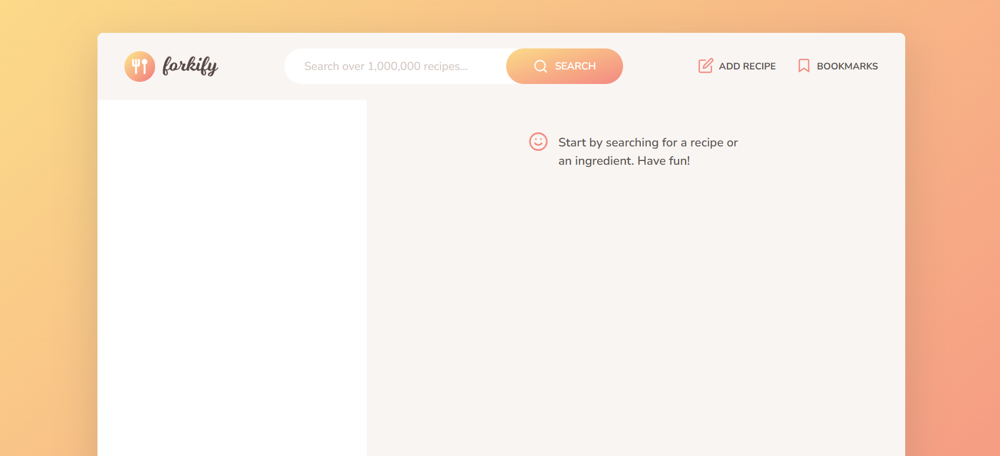
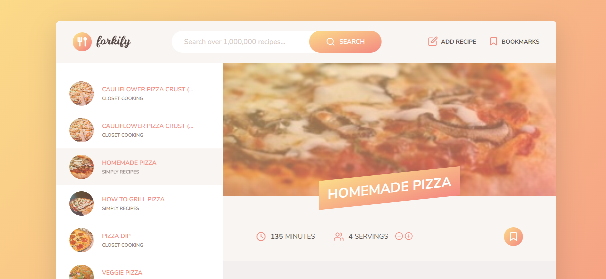
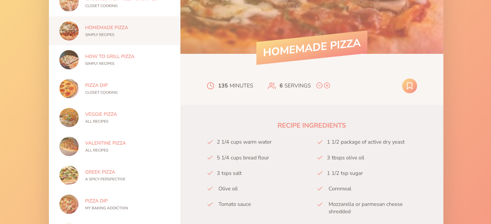
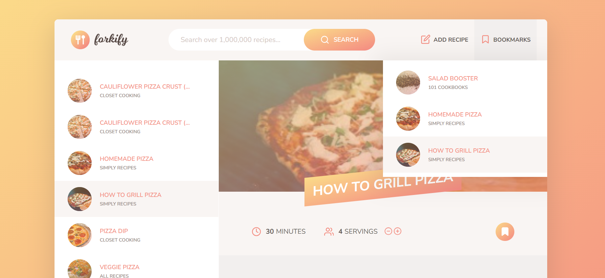
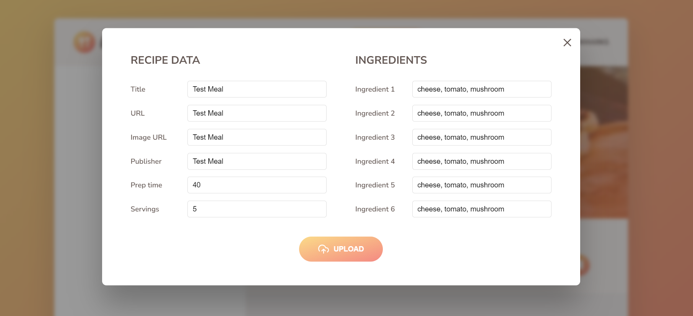
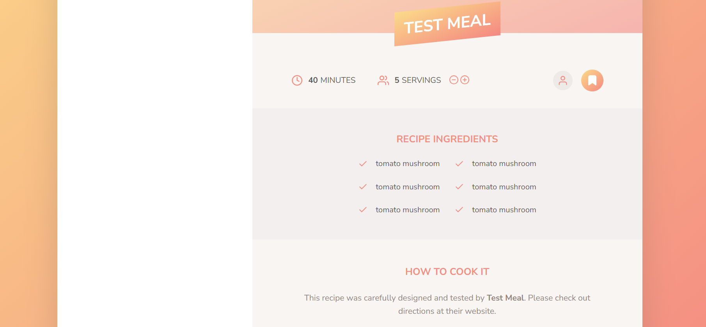

# Forkify

Forkify is a recipe finder website which you can discover and save or add your recipes. Forkify allows you to save your favorite recipres by bookmarking. It also adjusts the ingredients in the recipe according to the decreasing or increasing value of servings. Forkify paginates the result of the search. Forkify is the first project I used MVC model without using any framework 💎.
You can try by clicking <strong>[Forkify](https://forkify-gldn.netlify.app/)</strong>.

 

#### Technologies Used:

- core, fractional, regenerator-runtime npm packages
- HTML, CSS, JavaScript, Forkify API for front-end development.
- Netlify for hosting the web application.

   
   
 
   
   
 
   
   
 
   
   
 
   
   
 
   
   
 
